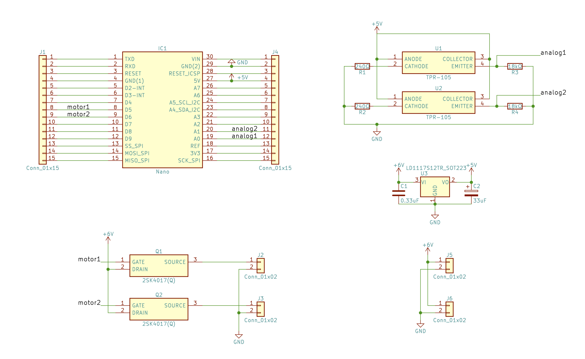
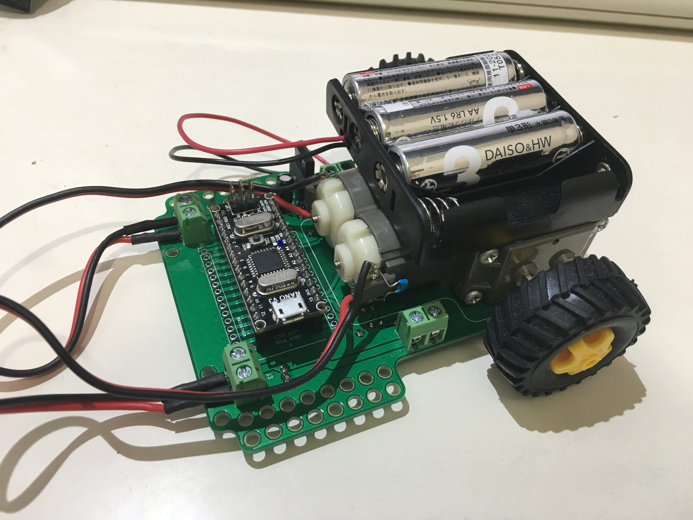

# ライントレーサーキット

## パーツリスト

|名前|個数|参考|
|:--|:--|:--|
|この基板|1|基板屋に受注してね|
|ターミナルブロック|4|[秋月電子](http://akizukidenshi.com/catalog/g/gP-02333/)|
|ピンソケット|15x1を2つ|[秋月電子](http://akizukidenshi.com/catalog/g/gC-05779/)|
|2SK4017(Q)|2|[秋月電子](http://akizukidenshi.com/catalog/g/gI-07597/)|
|TPR-105|2|[秋月電子](http://akizukidenshi.com/catalog/g/gI-03812/)|
|抵抗18kΩ|2|[秋月電子](http://akizukidenshi.com/catalog/g/gR-25183/)|
|抵抗240Ω|2|[秋月電子](http://akizukidenshi.com/catalog/g/gR-25241/)|
|TA4805SQ(パスコンセット)|1|[秋月電子](http://akizukidenshi.com/catalog/g/gI-00537/)|
|ギアボックス|1|[Amazon](https://www.amazon.co.jp/%E3%82%BF%E3%83%9F%E3%83%A4-%E6%A5%BD%E3%81%97%E3%81%84%E5%B7%A5%E4%BD%9C%E3%82%B7%E3%83%AA%E3%83%BC%E3%82%BA-No-168-%E3%83%80%E3%83%96%E3%83%AB%E3%82%AE%E3%83%A4%E3%83%9C%E3%83%83%E3%82%AF%E3%82%B9-%E5%B7%A6%E5%8F%B3%E7%8B%AC%E7%AB%8B4%E9%80%9F%E3%82%BF%E3%82%A4%E3%83%97/dp/B001Q13BIU)|
|電池ボックス|1|[秋月電子](http://akizukidenshi.com/catalog/g/gP-02671/)|
|Arduino nano|1|互換機をAliexpressなどで探す|
|ケーブル|適量||

## 作り方

instruction.pdfを読んでね。

## 写真

### 回路図

### 外観

